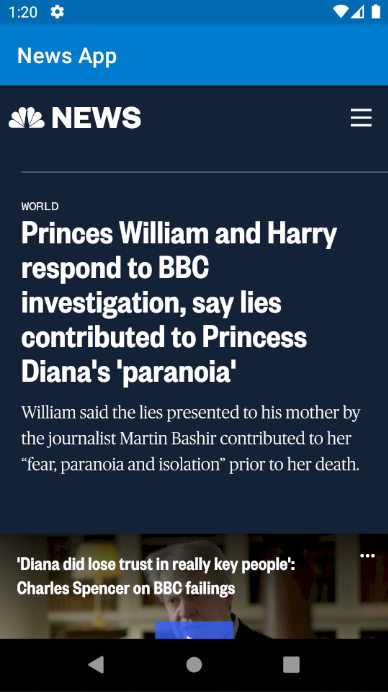

# ProjetMobileNewsApp 

RIKAB Mazen *Class 32*

This is a mobile application programmed in Java using Android Studio.

The main objective was to create an application using an API, so I chose a news related API: https://newsapi.org/

This is the small icon on the phone : <a href = "img/small_logo.png">  <a>

Here is how it should look like from the get go:

<a href = "img/main_activityy.png">  <a>

So first we have an ImageView with the branding name of the app :
  
  <a href = "img/big_logo.png">  <a>
    
After that I added a function that will __refresh__ the RecyclerView and all the cardViews will be renewed : 
    
<a href = "img/refresh_button.png">  <a>

When I click on an article (CardView), a WebWiew shows up : 
  
  <a href = "img/web_view.png">  <a>

  And that is pretty much all it does :D
